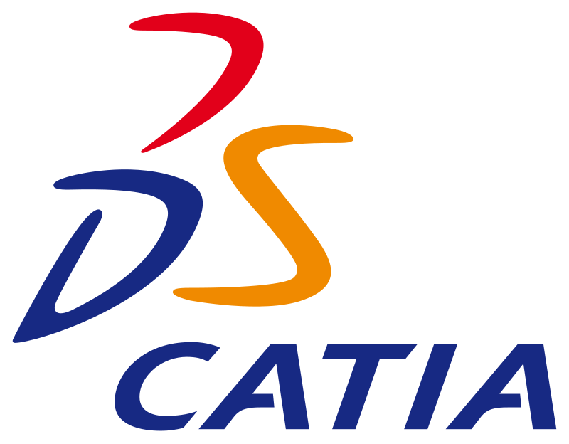

<h1 align="center">hey there, I'm Yee Long!</h1>
<h3 align="center">Computer Engineering undergraduate at NTU</h3>

 

- 🔭 I’m currently working on **full stack development, my personal finances, and 3D printing**

- 🌱 I’m currently learning **3D printing**

- 📫 How to reach me **yeelongsiah@gmail.com**

<h3 align="left">Languages and Tools:</h3>

 
     
     
     
     
     
     
     
     
    
     
    
    

